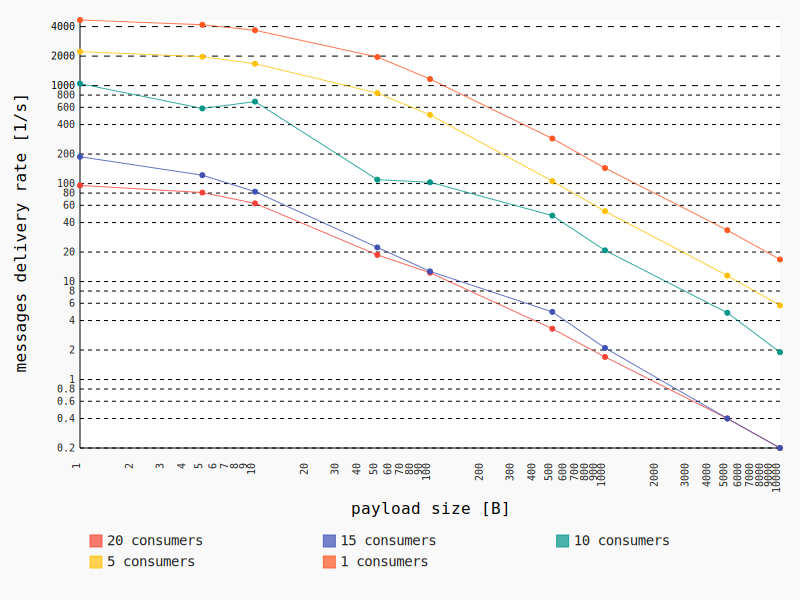
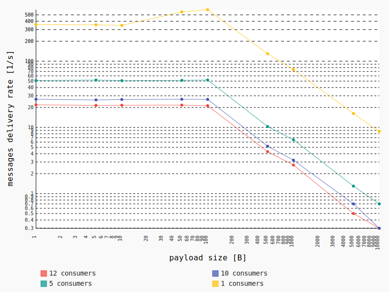

# PicoMQTT

This is a lightweight and easy to use MQTT library for ESP8266 and ESP32 devices.

  

[](https://www.ardu-badge.com/PicoMQTT) [](https://registry.platformio.org/libraries/mlesniew/PicoMQTT)

[](https://www.espressif.com/en/products/socs/esp8266) [](https://www.espressif.com/en/products/socs/esp32)

Features:
* Works in client and broker mode
* Implements [MQTT 3.1.1](https://docs.oasis-open.org/mqtt/mqtt/v3.1.1/os/mqtt-v3.1.1-os.html)
* Supports publishing and consuming of [arbitrary sized messages](#arbitrary-sized-messages)
* High performance -- the broker can deliver thousands of messages per second -- [see benchmarks](#benchmarks)
* Works on [WiFi, Ethernet and more](#custom-server-and-client-types)
* Supports connections over [websockets](#websocket-support)
* Easy integration with the [ArduinoJson](https://arduinojson.org/) library to publish and consume JSON messages -- [see examples](#json)
* Intuitive API
* Low memory usage

Limitations:
* Client only supports MQTT QoS levels 0 and 1
* Broker only supports MQTT QoS level 0, ignores will and retained messages.
* Currently only ESP8266 and ESP32 boards are supported


## Installation instructions

* [Arduino IDE](https://www.ardu-badge.com/PicoMQTT)
* [PlatformIO](https://registry.platformio.org/libraries/mlesniew/PicoMQTT/installation)

Additionally, PicoMQTT requires a recent version of the board core:
* For ESP8266 core version 3.1 or later
* For ESP32 core version 2.0.7 or later


## Quickstart

To get started, try compiling and running the code below or explore [examples](examples).

### Client

```
#include <Arduino.h>
#include <PicoMQTT.h>

PicoMQTT::Client mqtt("broker.hivemq.com");

void setup() {
    // Usual setup
    Serial.begin(115200);
    WiFi.mode(WIFI_STA);
    WiFi.begin("MyWiFi", "password");

    // Subscribe to a topic pattern and attach a callback
    mqtt.subscribe("#", [](const char * topic, const char * payload) {
        Serial.printf("Received message in topic '%s': %s\n", topic, payload);
    });

    // Start the client
    mqtt.begin();
}

void loop() {
    // This will automatically reconnect the client if needed.  Re-subscribing to topics is never required.
    mqtt.loop();

    if (random(1000) == 0)
        mqtt.publish("picomqtt/welcome", "Hello from PicoMQTT!");
}
```

### Broker

```
#include <Arduino.h>
#include <PicoMQTT.h>

PicoMQTT::Server mqtt;

void setup() {
    // Usual setup
    Serial.begin(115200);
    WiFi.mode(WIFI_STA);
    WiFi.begin("MyWiFi", "password");

    // Subscribe to a topic pattern and attach a callback
    mqtt.subscribe("#", [](const char * topic, const char * payload) {
        Serial.printf("Received message in topic '%s': %s\n", topic, payload);
    });

    // Start the broker
    mqtt.begin();
}

void loop() {
    // This will automatically handle client connections.  By default, all clients are accepted.
    mqtt.loop();

    if (random(1000) == 0)
        mqtt.publish("picomqtt/welcome", "Hello from PicoMQTT!");
}
```

## Publishing messages

To publish messages, the `publish` and `publish_P` methods can be used.  The client and the broker have both the same
API for publishing.

```
#include <PicoMQTT.h>

PicoMQTT::Client mqtt("broker.hivemq.com");  // or PicoMQTT::Server mqtt;

void setup() { /* ... */ }

void loop() {
    mqtt.loop();

    mqtt.publish("picomqtt/simple_publish", "Message");
    mqtt.publish("picomqtt/another_simple_publish", F("Message"));

    const char binary_payload[] = "This string could contain binary data including a zero byte";
    size_t binary_payload_size = strlen(binary_payload);
    mqtt.publish("picomqtt/binary_payload", (const void *) binary_payload, binary_payload_size);
}
```

Notes:
* It's not required to check if the client is connected before publishing.  Calls to `publish()` will have no effect and will return immediately in such cases.
* More examples available [here](examples/advanced_publish/advanced_publish.ino)


## Subscribing and consuming messages

The `subscribe` methods can be used with client and broker to set up callbacks for specific topic patterns.

```
#include <PicoMQTT.h>

PicoMQTT::Client mqtt("broker.hivemq.com");  // or PicoMQTT::Server mqtt;

void setup() {
    /* ... */

    mqtt.subscribe("picomqtt/foo", [](const char * payload) { /* handle message here */ });
    mqtt.subscribe("picomqtt/bar", [](const char * topic, const char * payload) { /* handle message here */ });
    mqtt.subscribe("picomqtt/baz", [](const char * topic, const void * payload, size_t payload_size) { /* handle message here */ });

    // Pattern subscriptions
    mqtt.subscribe("picomqtt/+/foo/#", [](const char * topic, const char * payload) {
        // To extract individual elements from the topic use:
        String wildcard_value = mqtt.get_topic_element(topic, 1);  // second parameter is the index (zero based)
    });

    mqtt.begin();
}

void loop() {
    mqtt.loop();
}
```

Notes:
* New subscriptions can be added at any point, not just in the `setup()` function.
* All strings (`const char *` parameters) are guaranteed to have a null terminator.  It's safe to treat them as strings.
* Message payloads can be binary, which means they can contain a zero byte in the middle.  To handle binary data, use a callback with a `size_t` parameter to know the exact size of the message.
* The topic and the payload are both buffers allocated on the stack.  They will become invalid after the callback returns.  If you need to store the payload for later, make sure to copy it to a separate buffer.
* By default, the maximum topic and payload sizes are is 128 and 1024 bytes respectively.  This can be tuned by using `#define` directives to override values from [config.h](src/PicoMQTT/config.h).  Consider using the advanced API described in the later sections to handle bigger messages.
* If a received message's topic matches more than one pattern, then only one of the callbacks will be fired.
* Try to return from message handlers quickly.  Don't call functions which may block (like reading from serial or network connections), don't use the `delay()` function.
* More examples available [here](examples/advanced_consume/advanced_consume.ino)

### Delivery of messages published on the broker

`PicoMQTT::Server` will not deliver published messages locally.  This means that setting up a `PicoMQTT::Server` and using `subscribe`, will fire callbacks only when messages from clients are received.  Messages published locally, on the same device will not trigger the callback.

`PicoMQTT::ServerLocalSubscribe` can be used as a drop-in replacement for `PicoMQTT::Server` to get around this limitation. This variant of the broker works just the same, but it fires subscription callbacks for messages published locally using the `publish` and `publish_P` methods.  Note that publishing using `begin_publish` will work as in `PicoMQTT::Server` (so it will not fire local callbacks).

`PicoMQTT::ServerLocalSubscribe` has slightly worse performance and can be memory intensive, especially if large messages are published and subscribed to locally.  Therefore, it should only be used when really needed.  Moreover, it has one additional limitation: it's *subscription callbacks must not publish any messages* or it may cause a crash.

Example available [here](examples/server_local_subscribe/server_local_subscribe.ino).


## Last Will Testament messages

Clients can be configured with a will message (aka LWT).  This can be configured by changing elements of the client's `will` structure:

```
#include <PicoMQTT.h>

PicoMQTT::Client mqtt("broker.hivemq.com");  // or PicoMQTT::Server mqtt;

void setup() {
    /* ... */

    mqtt.will.topic = "picomqtt/lwt";
    mqtt.will.payload = "bye bye";
    mqtt.will.qos = 1;
    mqtt.will.retain = true;

    mqtt.begin();
}

void loop() {
    mqtt.loop();
}
```

Notes:
* Will messages will only be active if `will.topic` is not empty.
* The `will` structure can be modified at any time, even when a connection is active.  However, it changes will take effect only after the client reconnects (after connection loss or after calling `mqtt.disconnect()`).
* Default values of `will.qos` and `will.retain` are `0` and `false` respectively.

## Connect and disconnect callbacks

The client can be configured to fire callbacks after connecting and disconnecting to a server.  This is useful if a message needs to be sent as soon as the connection is established:

```
#include <Arduino.h>
#include <PicoMQTT.h>

PicoMQTT::Client mqtt("broker.hivemq.com");  // or PicoMQTT::Server mqtt;

void setup() {
    Serial.begin(115200);

    /* ... */

    mqtt.connected_callback = [] {
        Serial.println("MQTT connected");
    }

    mqtt.disconnected_callback = [] {
        Serial.println("MQTT disconnected");
    }

    mqtt.begin();
}

void loop() {
    mqtt.loop();
}
```

Notes:
* It's safe to set or change the callbacks at any time.
* It is not guaranteed that the connect callback will fire immediately after the connection is established.  Messages may sometimes be delivered first (to handlers configured using `subscribe`).

## Arbitrary sized messages

It is possible to send and handle messages of arbitrary size, even if they are significantly bigger than the available
memory.

### Publishing

```
auto publish = mqtt.begin_publish(
        "picomqtt/advanced",  // topic
        1000000               // payload size
        );

// The returned publish is a Print subclass, so all Print's functions will work:
publish.println("Hello MQTT");
publish.println(2023, HEX);
publish.write('c');
publish.write((const uint8_t *) "1234567890", 10);

// We can always check how much space is left
size_t remaining_size = publish.get_remaining_size();

// ...

// Once all data is written, we have to send the message
publish.send();
```

### Consuming

```
mqtt.subscribe("picomqtt/advanced", [](const char * topic, PicoMQTT::IncomingPacket & packet) {
    // at any point we can check the remaining payload size
    size_t payload_size = packet.get_remaining_size();

    // packet is a Stram object, so we can use its methods
    int val1 = packet.read();

    char buf[100];
    packet.read(buf, 100);

    // it's OK to not read the whole content of the message
});
```

### Notes

* When consuming or producing a message using the advanced API, don't call other MQTT methods.  Don't try to publish multiple messages at a time or publish a message while consuming another.
* Even with this API, the topic size is still limited.  The limit can be increased by overriding values from [config.h](src/PicoMQTT/config.h).

## Json

It's easy to publish and subscribe to JSON messages by integrating with [ArduinoJson](https://arduinojson.org/).  Of course, you can always simply use `serializeJson` and `deserializeJson` with strings, but it's much more efficient to use the advanced API for this.  Check the examples below or try the [arduinojson.ino](examples/arduinojson/arduinojson.ino) example.

### Subscribing

```
mqtt.subscribe("picomqtt/json/#", [](const char * topic, Stream & stream) {
    JsonDocument json;

    // Deserialize straight from the Stream object
    if (deserializeJson(json, stream)) {
        // don't forget to check for errors
        Serial.println("Json parsing failed.");
        return;
    }

    // work with the object as usual
    int value = json["foo"].as<int>();
});
```

### Publishing

```
JsonDocument json;
json["foo"] = "bar";
json["millis"] = millis();

// publish using begin_publish()/send() API
auto publish = mqtt.begin_publish(topic, measureJson(json));
serializeJson(json, publish);
publish.send();
```

## Custom server and client types

By default, PicoMQTT will use the built-in WiFi interface of the device (using `WiFiClient` or `WiFiServer` objects internally).  You can, however, tell it to use custom classes instead.  This is useful to use PicoMQTT with TLS (e.g. using `WiFiClientSecure`) or with an Ethernet board.

### Clients

A PicoMQTT client can be used with any subclass of the standard Arduino `Client`.  To create an instance with a custom client object, pass it as the first argument to the `PicoMQTT::Client` constructor (the remaining parameters are the usual ones).  For example:

```
EthernetClient client;
PicoMQTT::Client mqtt(client, "broker.hivemq.com");
```

The `mqtt` instance can be used as usual.  Additional `client` setup can be done in the `setup()` function, before the `mqtt.begin()` call.

Full example available [here](examples/w5500_client/w5500_client.ino).

### Servers

A PicoMQTT server can be used with any class that has an interface roughly similar to other servers, e.g. `WiFiServer` or `EtherenetServer`.  The only required methods are `begin()` and `accept()`.  To set up a broker with a custom server, pass it as the first argument to the `PicoMQTT::Server` constructor, for example:

```
EthernetServer server(1883);
PicoMQTT::Server mqtt(server);
```

The `mqtt` instance can be used as usual.  Additional `server` setup can be done in the `setup()` function, before the `mqtt.begin()` call.

Full example available [here](examples/w5500_server/w5500_server.ino).

### Multiserver

Sometimes it's useful to run a broker, which can handle connections from different interfaces (e.g. WiFi and Ethernet).  This is also possible -- just pass multiple servers as parameters to the constructor:

```
WiFiServer wifi_server(1883);
EthernetServer eth_server(1883);
PicoMQTT::Server mqtt(wifi_server, eth_server);
```

With this setup, the `mqtt` instance will accept connections from both servers and will be able to route messages between them.

Full example available [here](examples/multi_server/multi_server.ino).

## Websockets support

PicoMQTT supports connections over WebSockets with the [PicoWebsocket](https://github.com/mlesniew/Picowebsocket) library.  With this dependency installed, broker and client set up is the same as with other custom sockets:

```
#include <PicoMQTT.h>
#include <PicoWebsocket.h>

// Create a server -- most other servers can be used here too (e.g. EthernetServer)
WiFiServer server(80);

// Create a websocket instance which uses the server
PicoWebsocket::Server<::WiFiServer> websocket_server(server);

// Create a MQTT server
PicoMQTT::Server mqtt(websocket_server);
```

Full example available [here](examples/websocket_server/websocket_server.ino).

## Benchmarks

Charts in this section show PicoMQTT how many messages a broker running on the ESP8266 and ESP32 was able to deliver per second per client depending on the payload size and the number of subscribed clients.
* Test were executed using the library version from commit 406e879e8b25b84c1488c1e2789e4b3719dd1496
* The library was using default configuration values (as defined in [config.h](src/PicoMQTT/config.h))
* Measurements were done on a PC using scripts in [benchmark/](benchmark/)
* The broker was configured to do nothing but forward the messages to subscribed clients, see [benchmark.ino](benchmark/benchmark.ino)
* The ESPs were connecting to a router just next to them to avoid interference.  The test PC was connected to the same router using an Ethernet cable.

### ESP8266



[Get CSV](doc/benchmark/esp8266.csv)

### ESP32



[Get CSV](doc/benchmark/esp32.csv)

## Special thanks

Many thanks to [Michael Haberler](https://github.com/mhaberler) for his support with the MQTT over WebSocket feature.

## License

This library is open-source software licensed under GNU LGPLv3.
